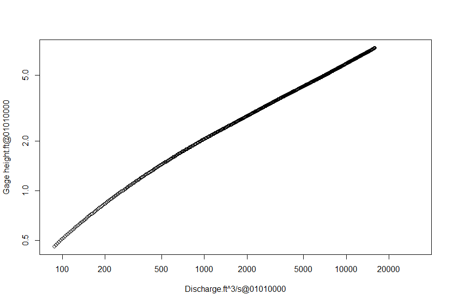

## Consuming AQUARIUS Time-Series data from R

[**Download** this project folder](https://minhaskamal.github.io/DownGit/#/home?url=https:%2F%2Fgithub.com%2FAquaticInformatics%2FExamples%2Ftree%2Fmaster%2FTimeSeries%2FPublicApis%2FR)

The R programming environment provides a rich ecosystem for numerical computing and graphic visualization.

Requires:
- [an R runtime](https://cran.rstudio.com/) 3.3-or-greater, any supported platform
- AQTS 2017.2 or later - To get time-aligned time-series data

### Recommended packages

Before consuming any data from AQTS, you'll need to be able issue HTTP requests to the public APIs and serialize data to/from JSON.

Install these packages to enable basic communication with your AQTS server from your R environment.
```R
> install.packages("jsonlite") # Fast JSON parser
> install.packages("httr") # Hadley's nice HTTP requests library
```

### Examples

- Example 1 - [Plotting stage vs. discharge](#example-1---plotting-stage-vs-discharge)
- Example 2 - [Wind rose plots](./WindRose)
- Example 3 - [Flood Frequency Analysis curves](./FloodFrequencyAnalysis)
- Example 4 - [Intensity Duration Frequency plots](./IntensityDurationFrequency)
- Example 5 - [Flow Duration curves](./FlowDurationCurve)

## The `timeseries_client.R` API wrapper

The [`timeseries_client.R`](./timeseries_client.R) file adds some objects and method to communicate with the public REST APIs of an AQTS system.

### Loading the wrapper into your workspace

```R
# Load the wrapper into your workspace
> source("timeseries_client.R")
```

A `timeseries` object will be added to your workspace.

### Authenticating with AQTS

Authenticate with your AQTS server using the `connect` method of the `timeseries` object, passing your AQTS credentials.
```R
# Connects to http://myserver/AQUARIUS as "myuser"
> timeseries$connect("myserver", "myusername", "mypassword")
```

All subsequent requests to the AQTS server will use the authenticated session.

### Disconnecting from AQTS

Your authenticated AQTS session will expire one hour after the last authenticated request made.

Your code can choose to immediately disconnect from AQTS by calling the `disconnect` method of the `timeseries` object.

```R
> timeseries$disconnect()
# The next request will fail with 401: Unuathorized
> timeseries$getTimeSeriesUniqueId("Stage.Label@Location")
Error Unauthorized (HTTP 401) ...
```

### Error handling

Any errors contained in the HTTP response will be raised through the `stop_for_status()` method from the `httr` package.

Your code can use standard R error handling techniques (like the `trycatch()` method) to handle errors as you'd like.

#### Capturing HTTP requests from R using Fiddler

[Fiddler](http://www.telerik.com/fiddler) is a great tool for capturing HTTP traffic on Windows systems.

You can manually configure your R environment to route its HTTP requests through the Fiddler proxy in order to the traffic in the Fiddler window.

```R
# The following tells R to use the default Fiddler endpoint as its HTTP proxy
> Sys.setenv(http_proxy="http://localhost:8888")

# And this disables the proxy (required if Fiddler is no longer running)
> Sys.setenv(http_proxy="")
```

As a convenience, when your R session uses the `timeseries$connect()` method to connect to an AQTS system, the R proxy will automatically be routed through Fiddler if it is running.

Other R platforms like Linux and OS X have similar debugging proxy tools available, and will need to be manually configured using the `Sys.setenv()` method.

## Example 1 - Plotting Stage vs. Discharge

The first step is simply to connect to AQTS and grab a year's worth of data for a stage/discharge pair.

```R
# Connect to AQTS
> timeseries$connect("myserver", "admin", "admin")

# Get the time-sligned data for the year 2012 for a discharge and stage time-series
> json = timeseries$getTimeSeriesData(c("Discharge.Working@Location","Stage.Working@Location"),
                                      queryFrom = "2012-01-01T00:00:00Z",
                                      queryTo   = "2013-01-01T00:00:00Z")
```
Now the points are in R data frames in the `json` object, so we can simply plot them as an XY plot.
```R
# Plot stage vs. discharge, in logspace, with labeled axis
> plot(json$Points$NumericValue1, json$Points$NumericValue2, log = "xy",
       xlab = json$TimeSeries$Identifier[1],
       ylab = json$TimeSeries$Identifier[2])
```

And here is the plot, which should match the rating curve for 2012.



# API wrapper methods

|Method|Works with|Description|
|---|---|---|
|connect(hostname, username, password)| All | Connects to the AQTS app server with the given credentials. |
|disconnect()| All | Disconnects the session from the app server. |
|getTimeSeriesUniqueId(timeSeriesIdentifier)| 201x | Gets the uniqueID of the time-series, required for many other methods. For 3.x systems, this method just returns the identifier, since uniqueIDs are a 201x feature.|
|getLocationIdentifier(timeSeriesIdentifier)| All | Extracts the location identifier from a "Parameter.Label@Location" time-series identifier |
|getLocationData(locationIdentifier)| All | Gets the location data, including extended-attributes. |
|getRatings(locationIdentifier, queryFrom, queryTo, inputParameter, outputParameter)| All | Gets all the rating models matching the request filter. (currently failing for 3.X) |
|getRatingModelOutputValues(ratingModelIdentifier, inputValues, effectiveTime, applyShifts)| All | Gets the output values of a rating model using specific inputs |
|getFieldVisits(locationIdentifier, queryFrom, queryTo, activityType)| All | Gets all the field visit data matching the filter. (currently failing for 3.x) |
|getTimeSeriesDescriptions(locationIdentifier, parameter, publish, computationIdentifier, computationPeriodIdentifier, extendedFilters)| All | Gets the time-series matching the filter.  |
|getTimeSeriesData(timeSeriesIds, queryFrom, queryTo, outputUnitIds, includeGapMarkers)| 2017.2+ | Gets the time-aligned data for multiple time-series. |
|getTimeSeriesCorrectedData(timeSeriesIdentifier, queryFrom, queryTo, getParts, includeGapMarkers)| All | Gets the corrected data for the time-series. |
|uploadExternalReport(locationDataOrIdentifier, pathToFile, title, deleteDuplicateReports) | 2017.3+ | Uploads an external report to the given location. |
|getReportList() | 2017.3+ | Gets all the generated reports on the system. |
|deleteReport(reportUniqueId) | 2017.3+ | Deletes a report from the system. |