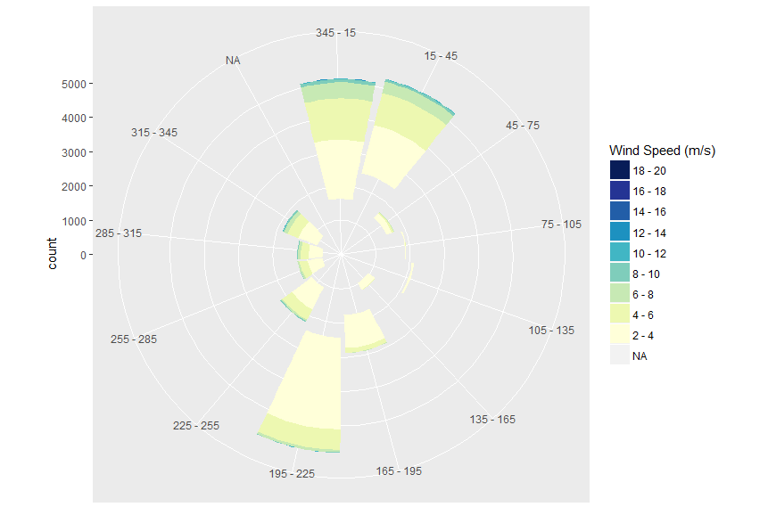

## Wind rose plots

[**Download** this project folder](https://minhaskamal.github.io/DownGit/#/home?url=https:%2F%2Fgithub.com%2FAquaticInformatics%2FExamples%2Ftree%2Fmaster%2FTimeSeries%2FPublicApis%2FR%2FWindRose)

Inspired almost completely by [this StackOverflow post](https://stackoverflow.com/questions/17266780/wind-rose-with-ggplot-r):

The wind rose example requires a few more common R packages to be installed:

```R
> install.packages("ggplot2") # Hadley's declarative "Grammar of Graphics"
> install.packages("scales") # Hadley's nice graphical scaling library
> install.packages("RColorBrewer") # Color schemes for maps & graphics
```

Now you can source the [`wind_rose_ggplot.R`](./wind_rose_ggplot.R) file into your workspace.
```R
> source("wind_rose_ggplot.R")
```

To plot the wind rose, we'll need to pull the 2011 data for both wind speed and direction from a location.

Because the StackOverflow example is expecting wind speed in meters-per-second, we'll need to ask for that time-series to convert its values from mile-per-hour to meters-per-second.

```R
# Grab the wind data for 2011.
> json = timeseries$getTimeSeriesData(
      c("Wind speed.mph.Work@01372058", "Wind direction.deg.Work@01372058"),
      outputUnitIds=c("m/s",""),
      queryFrom="2011-01-01T00:00:00Z",
      queryTo=  "2012-01-01T00:00:00Z")
```

Now we plot the points, using the code from the StackOverflow post.

```R
> plot.windrose(spd = json$Points$NumericValue1, dir = json$Points$NumericValue2)
```

Nifty neato!

